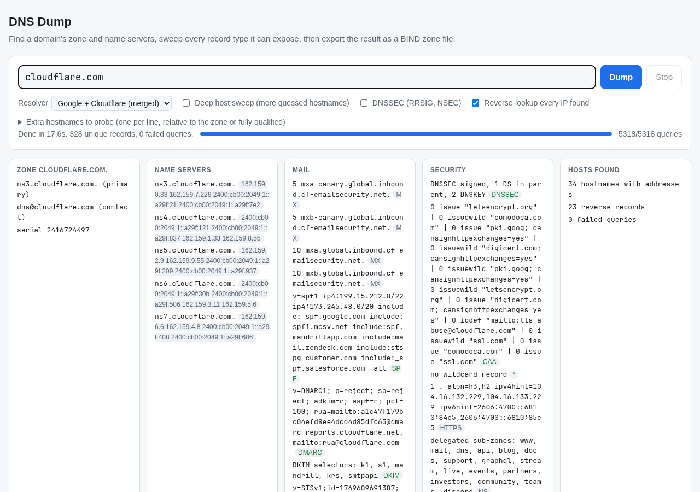

# DNS Dump

A single HTML file that finds a domain's zone and name servers, pulls every DNS record it can reach, and exports the result as a BIND zone file. It runs entirely in the browser over DNS-over-HTTPS. No server, no install.



## Use it

1. Open `index.html` in a browser, or host it anywhere static files are served.
2. Type a domain, hostname or URL and press **Dump**. `mail.example.com` and `https://www.example.com/path` both resolve to the zone `example.com`.
3. Wait for the status line to read **Done**. A run takes about 15 seconds.
4. Press **Download zone file**, or **CSV** or **JSON**. CSV and JSON export the rows the table shows, so a filter or type chip narrows them.

To open the page with a domain prefilled and running, add `?d=` to the URL:

```
index.html?d=example.com
```

## What a run does

1. Walks up from the name you typed, querying SOA at each label, until a name answers its own SOA. That name is the zone apex.
2. Fetches the apex NS set and the A and AAAA address of every name server.
3. Queries 39 record types at the apex, 9 types at each of about 200 guessed hostnames, TXT at 147 DKIM selectors, SRV at 104 service names, the mail and policy names (`_dmarc`, `_mta-sts`, `_smtp._tls`, `default._bimi`, `_acme-challenge` and others), and the wildcard `*`.
4. Queries NS at every guessed hostname and sweeps any delegated sub-zone it finds.
5. Reverse-looks-up every IP address found.
6. Sends every query to both Google and Cloudflare DNS-over-HTTPS and merges the answers. A record present in only one resolver's answer shows a single name in the Source column.

## Options

| Option | Default | Effect |
|---|---|---|
| Resolver | Google + Cloudflare | Which DNS-over-HTTPS endpoints to query. Merged mode dedupes answers across both. |
| Deep host sweep | off | Probes about 950 guessed hostnames instead of 200. |
| DNSSEC | off | Adds `do=1` to every query and also asks for RRSIG, NSEC and NSEC3. |
| Reverse-lookup every IP found | on | Adds a PTR query for each unique A and AAAA address. |
| Extra hostnames to probe | empty | One name per line. A bare label is probed under the zone; a fully qualified name is probed as typed. |

## The table

Each row carries a **Scope** badge:

| Scope | Meaning | In the zone file |
|---|---|---|
| zone | Owner name is inside the zone | yes |
| child zone | Inside a delegated sub-zone; belongs to that zone's file | no |
| parent zone | The apex DS record, which lives in the parent | no |
| dnssec | RRSIG, NSEC, NSEC3; generated by the signer | no |
| external | A CNAME target or glue outside the zone | no |
| reverse | A PTR record under `in-addr.arpa` or `ip6.arpa` | no |

Click a type chip to filter by record type. Click a column header to sort. The search box matches name, type and data.

## The zone file

The export is a BIND master file: `$ORIGIN`, `$TTL`, a parenthesised SOA, apex NS records, then every other zone record grouped by owner name and relative to the origin. TXT data is quoted, escaped and split into 255-character strings. Name-bearing data (CNAME, MX, NS, SRV, PTR) is absolute with a trailing dot.

The header comments state the method and the date. TTLs are the values the resolvers returned, so a cached record shows its remaining TTL rather than the configured one.

## Limits

- A browser cannot do a zone transfer or query an authoritative server directly. Only names the tool guesses or discovers appear. Unusual hostnames are missed unless you add them under **Extra hostnames to probe**.
- Every query goes to Google and Cloudflare. Do not use the tool on a domain whose hostnames must stay private.
- Google rejects the mnemonic for some record types, so the tool sends numeric type codes to Google.
- A large sweep can trip a resolver's per-client limit. When a resolver refuses a query, every worker on that resolver pauses, the pause doubles on each further refusal up to 30 seconds, and the query is retried up to 8 times. The status line shows the pause. If a resolver is still refusing after 7 pauses (about 90 seconds) it is marked unavailable for the run: in merged mode the other resolver already carries every query, and in single-resolver mode the remaining queries go to the other resolver with a notice.

## Development

The whole tool is `index.html`. There is no build step. Run the tests with `node --test`. They load the script up to the rendering section and exercise the pure helpers. The same helpers are exposed on `window.dnsDump` (frozen, `version: 1`) for use from the console or a headless browser:

```js
dnsDump.normalizeInput('https://www.Example.com/x')   // "www.example.com."
dnsDump.quoteTxt('v=spf1 -all')                        // '"v=spf1 -all"'
dnsDump.buildZoneFile()                                // after a run
dnsDump.getRecords()                                   // snapshot of every record with its scope
```

## License

MIT. See `LICENSE`.
